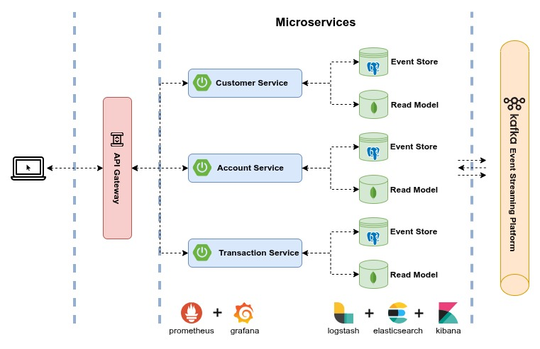

<p align="center">
  <br />
  
</p>
<div align="center">

  [](https://www.oracle.com/java/technologies)
  [](https://spring.io/projects/spring-framework)
  [](https://spring.io/projects/spring-boot)
  [](https://spring.io/projects/spring-security)
  [](https://spring.io/projects/spring-data-jpa)
  [](https://spring.io/projects/spring-cloud)
  [](https://junit.org/junit5/)
  [](https://site.mockito.org/)
  [](https://swagger.io/specification/)
  [](https://www.postgresql.org)
  [](https://www.mongodb.com)
  [](https://projectlombok.org)
  [](https://mapstruct.org)
  [](https://www.keycloak.org)
  [](https://kafka.apache.org)

</div>

## 📑 <a name="table">Table of Contents</a>

1. 📌 [About the project](#about-the-project)
2. 🏗️ [Architecture](#architecture)
3. ✨ [Features](#features)
4. 🛠️ [Tech Stack](#tech-stack)
5. 📁 [Project Structure](#project-structure)
6. 🧩 [Microservice Structure](#microservice-structure)
7. ⚡ [Quick Start](#quick-start)
8. 📄 [API Documentation](#api-documentation)
9. 🌐 [API Endpoints](#api-endpoints)
10. 🔧 [Tools Endpoints](#tools-endpoints)
11. 🔗 [Related Project](#related-project)
12. 🤝 [Contributing](#contributing)
13. ✉️ [Contact](#contact)

## <a name="about-the-project">📌 About the project</a>

**E-Bank (Backend)** is a Spring-based microservices project designed to manage banking customers, accounts and financial transactions.
Built using the Spring ecosystem, it adopts a Hexagonal Architecture to ensure a clean separation between business logic and infrastructure,
simplifying testing, maintenance and future improvements.

The project is composed of multiple domain-driven microservices, each responsible for a specific business area such as Customers, Accounts and Transactions.
Each microservice is secured using JWT tokens issued by Keycloak and implements CQRS (Command Query Responsibility Segregation) and Event Sourcing, ensuring clear separation of responsibilities, full traceability and reliable state reconstruction.
Inter-service communication is implemented using a hybrid approach: asynchronously via Apache Kafka for event-driven processing, and synchronously via Spring WebClient for real-time interactions.

Monitoring and logging are handled using the ELK Stack, Prometheus, Zipkin and Grafana. These tools provide system visibility, performance tracking and request tracing across microservices.
Also, the microservices use a service registry and a centralized configuration server to ensure discoverability and consistent configuration.

## <a name="architecture">🏗️ Architecture</a>



## <a name="features">✨ Features</a>

- JWT-based authentication and authorization for secure access control.
- Customer management with create, update and delete operations.
- Support for multiple bank accounts (Checking and Savings) per customer.
- Processing of financial transactions with balance validation and real-time updates, including:
    - Fund deposits.
    - Bill payments.
    - Internal account transfers.
    - Fund withdrawals.

## <a name="tech-stack">🛠️ Tech Stack</a>

### Backend

- Java 17+
- Spring Boot 3.1.5
- Spring Cloud (Eureka, Config, Gateway & Circuit Breaker)
- Spring Security & Keycloak
- Spring Data JPA

### Database

- PostgreSQL
- MongoDB

### Messaging & Queue

- Apache Kafka

### Testing

- JUnit 5 & Mockito

### API Documentation

- OpenAPI 3

### Monitoring & Logging

- Prometheus, Zipkin & Grafana
- ELK Stack

## <a name="project-structure">📁 Project Structure</a>

```
e-bank-backend/
├─ service-registry/
├─ config-server/
├─ api-gateway/
├─ account-service/
├─ customer-service/
├─ transaction-service/
├─ common-utils/
├─ common-config/
├─ docs/
├─ docker-compose.yml
└─ README.md
```

## <a name="microservice-structure">🧩 Microservice Structure</a>

Overview of the microservice structure, including the main packages and layers:

```
account-service/
├─ src/
│ ├─ main/java/com/ebank/accountservice
│ │ ├─ application/
│ │ │ ├─ commands/
│ │ │ └─ queries/
│ │ ├─ domain/
│ │ │ ├─ aggregate/
│ │ │ ├─ entity/
│ │ │ ├─ events/
│ │ │ ├─ messaging/
│ │ │ │ ├─ consumer/
│ │ │ │ ├─ producer/
│ │ │ │ └─ handler/
│ │ │ ├─ repositories/
│ │ │ ├─ services/
│ │ │ └─ utils/
│ │ ├─ infrastructure/
│ │ │ ├─ logging/
│ │ │ ├─ messaging/
│ │ │ ├─ repositories/
│ │ │ └─ resources/
│ │ └─ presentation/
│ │ │ ├─ controllers/
│ │ │ │ ├─ commands/
│ │ │ │ └─ queries/
│ │ │ ├─ dto/
│ │ │ └─ exception/
│ │ └─ AccountServiceApplication.java
│ └─  test/
```

## <a name="quick-start">⚡ Quick Start</a>

Follow these steps to set up the project locally on your machine.

**Prerequisites**

Make sure you have the following installed on your machine:

- [Git](https://git-scm.com/)
- [Java 17+](https://www.oracle.com/java/technologies/javase/jdk17-archive-downloads.html)
- [Maven 3.8+](https://maven.apache.org/)
- [Docker & Docker compose](https://www.docker.com/)

**Cloning the repository**

```bash
git clone https://github.com
cd e-bank-backend
```

**Start infrastructure services**

```bash
docker-compose up -d
```

**Set Up the databases**

Before running the microservices, ensure that the following databases exist. If they do not, create them manually using PgAdmin and Mongo Express, then restart the containers.

1- Required databases for PostgreSQL:
* keycloak
* customer_events_store_dev
* account_events_store_dev
* transaction_events_store_dev

2- Required databases for MongoDB:
* customer_read_dev
* account_read_dev
* transaction_read_dev

**Set Up keycloak**

1- Login to Keycloak Admin Console via: `http://localhost:9090/admin/`

2- Create a new Realm with the following settings:
* Realm Name: `e-bank-dev`
* Enabled: `true`

3- Create an OpenID Connect client in the `e-bank-dev` realm using the settings below:
* Client ID: `e-bank-api`
* Client Protocol: `true`
* Client Authentication:  `false`
* Standard Flow: `true`
* Direct Access Grants: `true`
* Authorization: `false`
* Valid Redirect URIs: `*`
* Web Origins: `*`

4- Create a Client scope with the following settings:
* Name: `full_permissions`
* Display on consent screen:  `true`
* Include in token scope: `true`

5- Create a Realm role using the settings below:
* Role Name: `ADMIN`
* Description: Application administrator

6- Create a User with the following attributes:
* UserName: `admin`
* Enabled: `true`
* Email Verified: `false`

then define credentials for the user:
* Password: `admin`
* Temporary: `false`

7- Assign the Realm role `ADMIN` to the user `admin`.

8- Assign the Client scope `full_permissions` to the client `e-bank-api`.

**Build and run microservices**

```bash
mvn clean install
mvn spring-boot:run -pl service-registry
mvn spring-boot:run -pl config-server
mvn spring-boot:run -pl api-gateway
mvn spring-boot:run -pl customer-service
mvn spring-boot:run -pl account-service
mvn spring-boot:run -pl transaction-service
```

## <a name="api-documentation">📄 API Documentation</a>

Once all microservices are running, the API Documentation is accessible through the links below:

| Service              | Swagger UI URL                           |
|----------------------|------------------------------------------|
| Customer Service     | `http://localhost:5005/swagger-ui.html`  |
| Account Service      | `http://localhost:5006/swagger-ui.html`  |
| Transaction Service  | `http://localhost:5007/swagger-ui.html`  |

## <a name="api-endpoints">🌐 API Endpoints</a>

All E-Bank services are accessible through the API Gateway at `http://localhost:9191`. Below are the available endpoints by service:

**Auth Service (via Keycloak)**

| Method | Endpoint                                            | Description                    | Authentication required |
|--------|-----------------------------------------------------|--------------------------------|-------------------------|
| POST   | `realms/e-bank-dev/protocol/openid-connect/token`   | Login & get/refresh JWT token  | No                      |
| GET    | `realms/e-bank-dev/protocol/openid-connect/certs`   | Validate JWT token             | No                      |
| POST   | `realms/e-bank-dev/protocol/openid-connect/logout`  | Logout                         | No                      |

**Customer Service**

| Method | Endpoint                              | Description                | Authentication required |
|--------|---------------------------------------|----------------------------|-------------------------|
| GET    | `customer-service/v1/customers`       | Get all customers          | Yes                     |
| GET    | `customer-service/v1/customers/{id}`  | Get single customer by ID  | Yes                     |
| POST   | `customer-service/v1/customers`       | Create new customer        | Yes                     |
| PUT    | `customer-service/v1/customers/{id}`  | Update customer            | Yes                     |
| DELETE | `customer-service/v1/customers/{id}`  | Delete customer            | Yes                     |

**Account Service**

| Method | Endpoint                                   | Description               | Authentication required |
|--------|--------------------------------------------|---------------------------|-------------------------|
| GET    | `account-service/v1/accounts`              | Get all accounts          | Yes                     |
| GET    | `account-service/v1/accounts/{id}`         | Get single account by ID  | Yes                     |
| POST   | `account-service/v1/accounts`              | Create new account        | Yes                     |
| PATCH  | `account-service/v1/accounts/{id}/close`   | Close account             | Yes                     |
| PATCH  | `account-service/v1/accounts/{id}/reopen`  | Reopen account            | Yes                     |

**Transaction Service**

| Method | Endpoint                                                           | Description                   | Authentication required |
|--------|--------------------------------------------------------------------|-------------------------------|-------------------------|
| GET    | `transaction-service/v1/transactions`                              | Get all transactions          | Yes                     |
| GET    | `transaction-service/v1/transactions/{id}`                         | Get single transaction by ID  | Yes                     |
| POST   | `transaction-service/v1/transactions/{account_id}/deposit-funds`   | Deposit funds                 | Yes                     |
| POST   | `transaction-service/v1/transactions/{account_id}/withdraw-funds`  | Withdraw funds                | Yes                     |
| POST   | `transaction-service/v1/transactions/{account_id}/make-payment`    | Make payment                  | Yes                     |
| POST   | `transaction-service/v1/transactions/{account_id}/transfer-funds`  | Transfer funds                | Yes                     |

## <a name="tools-endpoints">🔧 Tools Endpoints</a>

The following links provide access to the tools used for the project:

| Tool                               | URL                             | Credentials                               |
|------------------------------------|---------------------------------|-------------------------------------------|
| Service Registry (Netflix Eureka)  | `http://localhost:8761`         | No authentication required                |
| Keycloak                           | `http://localhost:9090/admin/`  | Username: admin / Password: admin         |
| PgAdmin                            | `http://localhost:5050`         | Email: root@pgadmin.org / Password: root  |
| Mongo Express                      | `http://localhost:8081`         | Username: admin / Password: admin         |
| Kibana (ELK Stack)                 | `http://localhost:5601`         | No authentication required                |
| Prometheus                         | `http://localhost:9099`         | No authentication required                |
| Grafana                            | `http://localhost:3009`         | Username: admin / Password: admin         |
| Zipkin                             | `http://localhost:9411`         | No authentication required                |

## <a name="related-project">🔗 Related Project</a>

This project is designed to work with the following frontend project:

* [**E-Bank (Frontend)**](https://github.com/)

Run them together for a complete full-stack demonstration.

## <a name="contributing">🤝 Contributing</a>

* If you find this project useful, please consider giving it a start ⭐. Thanks!
* Feel free to suggest improvements or report any issues in the repository.

## <a name="contact">✉️ Contact</a>

If you have any question or feedback, please feel free to contact me:

* **Maintainer**: ELASRI Hicham - [in/HichamElasri]() - `hi.elasri@gmail.com`
* **Project Link**: https://github.com/
